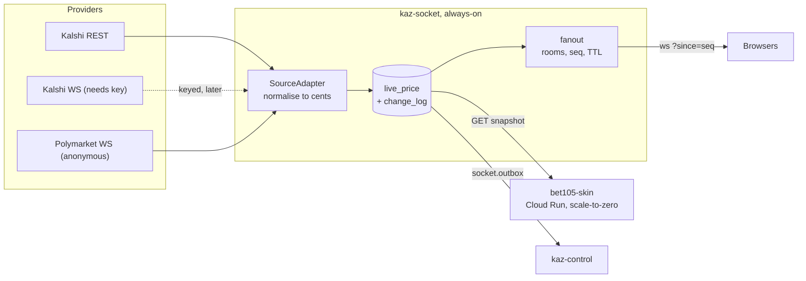

# kaz-socket: architecture, cost model and the US election slice

Status: **plan**. The service does not exist yet.
Companion documents: the [API survey](https://kaz-markets.github.io/prediction-markets-report/)
this is built on, and the `kaz_skin_off_drever_onto_gcp` plan it pairs with.

---

## 0. Where the plan and the research live

One repo holds both, so the plan and the evidence behind it cannot drift
apart.

| | |
|---|---|
| **`kaz-markets/prediction-markets-report`** (public) | The API research: what Kalshi and Polymarket expose, measured. Plus an **Elections** section, plus this plan. |
| **`kaz-markets/kaz-socket`** (private) | The service this document describes. Built after this plan is published. |
| **`kaz-markets/<skin repo>`** (private) | The bet105 skin. Already built and pushed, parked on the `drhamilton.dev` GCP account and `OPTIC_API_KEY`. |

---

## 1. What changed since the first draft

- The pros and cons of each scope option are **a report, not a decision made
  quietly**. Section 3, and it explains "outbound only" in plain words.
- A **live cache with TTL, priced against a straight relay**. Section 5.
- The first target moved from "replace Optic" to **a category the incumbent
  does not carry**, then narrowed to **US election markets**. Section 6.
- **Rate limits and costs** for Kalshi, Polymarket, Novig and Optic.
  Section 4, with measured numbers.
- The front end **can change**. Section 8.
- `kaz_skin_off_drever_onto_gcp` Phase 0 is **complete and verified**, so this
  is the other half of a two-repo stack. Section 2.
- A finding that was not expected: **price-history and candlestick surfaces
  are free on both venues**, so a self-built history costs storage only.
  Section 4.

---

## 2. The two-repo boundary

`kaz_skin_off_drever_onto_gcp` is Phase 0 complete, Phase 1 parked.

- Phase 0 done: socket-service revert merged, WAF back to the two original
  origins, Route 53 records deleted, `kaz` namespace and ALBs gone,
  `deploy/kaz/` removed from kaz-control.
- Phase 1 (the bet105 skin repo) is **built and pushed**, waiting on the
  `drhamilton.dev` GCP account and `OPTIC_API_KEY`.
- Phase 2 asks for *"a separate always-on service (its own repo or deployable)
  that holds the feed connection and exposes the latest snapshot over an
  internal HTTP endpoint"*, because Cloud Run scale-to-zero cannot hold a
  long-lived connection.

**That separate always-on service is `kaz-socket`.** The skin plan reserves
the role; this plan fills it.

The seam, stated once so neither plan drifts:

| | kaz-socket | bet105-skin |
|---|---|---|
| Owns | upstream connections, realtime fanout | SPA, HTTP API, demo balance |
| Lifecycle | always-on | scale-to-zero, stateless |
| Data | holds provider sockets | reads a snapshot over HTTP, subscribes for pushes |
| Never | renders a page, owns a bet | holds a provider socket |

Neither hosts the other's protocol. The drever `pandora.danchrow.com` socket
stays out of both, per Phase 2's explicit deferral.

---

## 3. The scope decision

### The three options in plain words

- **Inbound only.** kaz-socket is the *front door for data coming in*. It
  opens the sockets **to Kalshi and Polymarket** and hands the numbers to
  kaz-control. It holds no browser connections. Nothing a player sees changes.
- **Outbound only.** kaz-socket is the *loudspeaker*. It holds no provider
  connection; it takes prices kaz-control already computed and pushes them
  **out to browsers**. It replaces the five `/ws/*` endpoints. All the data
  still arrives the old way.
- **Both.** The front door and the loudspeaker in one service.

### A. Inbound only

**Pros.** Smallest real win, and it is the slice the election work needs.
Kalshi and Polymarket are mocks today, so this makes them real. Takes snapshot
pulls and socket parsing off the API event loop, which `STATUS.md` already
lists as a pressure point. The seam is already defined (`SourceAdapter`,
`QuoteSink`, `Quote`, `SourceHealth`), so nothing has to be invented. No auth
to duplicate.

**Cons.** Does not fix delivery or scale; `/ws/*` stays single-process with no
resume. Needs a kaz-control change to consume the result.

### B. Outbound only

**Pros.** Fixes a measured gap: two socket replicas that share no state, no
resume, no rooms. Ships without touching the odds path. Serves the existing
watchdog delivery check and the QA loop that compares app against server
against WebSocket.

**Cons.** Has to reproduce five endpoints **plus** `resolveSession` auth, so
permissions get duplicated. It has no data of its own, so it cannot be built
or demoed before the input side exists. Weakest standalone demo.

### C. Both

**Pros.** One coherent shape. One change log serves both directions: inbound
changes land in it, outbound resume reads from it. Avoids building the bus
twice, and it is where the platform ends up regardless.

**Cons.** Biggest surface, two integration seams at once, largest blast
radius, slowest to a demo.

### Recommendation

**Build the shared core, ship A as the first real slice, keep C as the
destination.** A is what the election goal needs, it needs no auth
duplication, and its `live_price` plus `change_log` tables are exactly what B
needs later. B then becomes a transport addition, not a rebuild.

---

## 4. Cost and rate limits

### Published limits

**Kalshi — free.** Token-bucket budgets: Basic 200 read/s and 100 write/s;
Advanced 300/300 by calling one upgrade endpoint once (needs at least 1 of the
last 100 orders placed via API). The default call cost is 10 tokens, so
**Basic sustains roughly 20 read calls/s and Advanced 30, at no charge**, with
3x burst above Basic. REST market data is anonymous. **The WebSocket requires
a signed handshake** — measured as HTTP 401 when attempted anonymously.

**Polymarket — free.** No credentials for market data. Cloudflare IP limits
per endpoint: CLOB `/book`, `/price`, `/midpoint` 1,500 per 10s;
`/prices-history` 1,000 per 10s; Gamma `/markets` 300 per 10s. Public
WebSocket.

**Novig — no public pricing.** Published limits: data retrieval 256/s, order
placement 64/s, GraphQL 650/min, `get-ticks` 128/s. Streaming is
`wss://api.novig.us/tape` with a 15-second protocol ping. It is a sports
exchange, so **it carries no US election markets and is out of scope for this
slice.**

**OpticOdds — no public pricing, sales-led.** Standard 2,500 per 15s,
streaming 250 per 15s, historical 10 per 15s; a maximum of 5 sportsbooks per
request and 10 leagues per stream. Community-reported pricing starts around
**$5,000 per month per sport**, unverified and not published by the vendor.

### The headline on cost

**US election markets cost nothing in data fees.** Both venues serve market
data anonymously and both publish election catalogs. There is no per-sport
contract, unlike adding a sport to a commercial feed. If Optic's real number
is anywhere near the community-reported figure, **not needing an Optic
sport add-on for elections avoids on the order of $5,000 per month** — and
that figure should be treated as unverified until Optic quotes it.

### A useful side finding

Both venues give away **free history**: Kalshi
`/series/{series}/markets/{ticker}/candlesticks` and `/historical/*`,
Polymarket `/prices-history` and the full on-chain ledger on Polygon. A
self-built price history costs storage, not a data licence.

---

## 5. Live cache with TTL versus a straight relay

### What each one is

- **Straight relay.** Hold the upstream socket, forward every message to every
  subscriber. Nothing is stored; the clients are the state.
- **Live cache with TTL.** Hold the upstream socket, write the current value
  into a cache with a time-to-live, and publish only on real change and at
  most once per TTL window. Clients read the cached value and receive pushes
  when it moves.

### Where the cost actually is

Not bandwidth, for elections. The measured rate is tiny. It is in three other
places:

1. **Upstream connections and provider budget.** These belong to the
   **account, not the instance**. A relay scales by adding instances, and each
   instance opens its own upstream and burns the same budget again. A cache
   with a single leader lease opens **one** upstream no matter how many
   instances run.
2. **Cold start and restart.** A relay has no memory, so every reconnect and
   every deploy re-pulls the whole board. A cache resumes from `change_log`.
3. **Fanout amplification.** A relay's egress grows with
   *ticks × subscribers*. A TTL coalesces that to *changes × subscribers*.
   Elections are small either way, but the slice must not paint us into a
   corner for live sports later.

### Priced

At the measured **0.0402 messages per token per second** (one update every
**24.9 seconds**):

| Quantity | Straight relay | Cache with a 1s TTL |
|---|---|---|
| Upstream messages/s, 1,000 markets (2,000 tokens) | ~80 | ~80 |
| Upstream connections as instances grow | **one per instance**, each burning the provider budget again | **one total**, via a single leader lease |
| Egress at 500 clients watching everything | ~40,000 msg/s | at most ~1,000 msg/s |
| After a restart or deploy | re-pulls the whole board | resumes from the change log |

Storage stays cheap by design: **no tick is logged**. `live_price` is one
upsert per `(source, selection)`, bounded by catalog size, and `change_log`
holds only post-coalesce publishes, trimmed to a short window. Roughly 80
upserts/s batched is trivial — kaz-control already sustains 100 plays/s.

Compute is the only real cost: a small always-on instance is roughly
**$10–20 per month** on Cloud Run, or **$0** on a free-tier e2-micro. The skin
stays scale-to-zero.

**Verdict: build the cache with TTL, not a relay.** It is cheaper at every
size, it is the only shape that survives a restart, and it is the only shape
that does not multiply provider load as the service scales. The relay's one
advantage — minimum latency, no write hop — does not matter for markets that
move twice a minute, and can be recovered later by keeping the hot path in
memory and treating the cache as the durable copy.

---

## 6. The first slice: US election markets

Why this beats replacing Optic:

- **Zero data cost and no negotiation**, against an Optic sport add-on at an
  unverified ~$5,000 per month.
- **Nothing to migrate.** Optic stays exactly as it is for sports. The change
  is purely additive, so there is no cutover risk and no sports regression.
- **A category the incumbent does not carry.** DraftKings' depth is US sports;
  Kalshi and Polymarket's depth is elections and politics.
- **A gentle tick rate**, so the first release cannot be embarrassed by
  latency and the caching design is proven without load.

### Measured coverage

- **Kalshi:** 462 US-election series inside a 1,989-series Elections category.
  A 40-series sample held 263 open markets.
- **Polymarket:** 635 genuinely open US election markets. A naive sweep
  counted 1,769 candidates; **747 were resolved** and had to be filtered out.

### Measured tick rate

61 messages in 63.3 seconds across 24 outcome tokens: **0.96 messages/s
overall, 0.0402 per token per second, one update every 24.9 seconds per
market.** Frame mix was 12 book snapshots, 6 price changes, 1 last-trade
price. Live sports is orders of magnitude faster.

### Scope

Catalog from Kalshi (`category=Elections`, filtered to US series) and
Polymarket (politics tags, search, and a volume-ranked sweep). Both normalised
into the shape kaz-control already understands: `Quote.cents` as a 1..99
contract price, converted by the existing `probToAmerican(cents / 100)`. One
new market kind for election markets, plus a mutually-exclusive-leg flag so a
parlay cannot combine two outcomes of the same race. A live demo board.

Out of scope: settlement, grading, anything involving real money.

### Integration notes found while measuring

- **Resolved markets are returned by default.** A resolved market carries a 0
  or 1 outcome price, which is the reliable filter.
- **The cents scale is not always 1 to 99.** Polymarket quotes longshots below
  a cent, so a contract price of `0.05` cents is real. A reader that clamps
  cents to a whole number silently drops those markets.
- **Longshot American prices explode.** A 0.05-cent contract is roughly
  `+199,900` in American odds. Arithmetically correct, useless on a screen, so
  an election UI needs a floor.
- **Kalshi's election catalog is mostly far-dated.** The busiest open series in
  the sample carried 13 markets.

---

## 7. Schema fit against kaz-control

**kaz-socket owns `socket.*` in the same Postgres**, applied by its own runner
writing `socket.schema_migrations`, so kaz-control's `001`–`046` is untouched.

Two gotchas found by reading the code:

- `enable_tenancy(tbl)` in `server/migrations/004_tenancy.sql` builds its DDL
  with `format('%I', tbl)`, so passing `socket.connections` would quote the
  whole dotted name as a single identifier and break. The `socket` schema
  needs its own helper mirroring the same policy shape (`app.tenant_id`, RLS,
  and the `bracco_app` grant).
- kaz-control's runner globs `migrations/*.sql` against a single
  `public.schema_migrations`. kaz-socket must not drop files there.

### Tables

| Table | Purpose |
|---|---|
| `socket.schema_migrations` | kaz-socket's own applied-migration record |
| `socket.instances` | service instances, for presence and the leader lease |
| `socket.connections` | one row per live connection |
| `socket.subscriptions` | connection to room, with its filter |
| `socket.rooms` | room registry |
| `socket.live_price` | **the TTL cache**: current value per source and selection |
| `socket.change_log` | **bounded**, post-coalesce publishes, for resume |
| `socket.deliveries` | sent/acked, for end-to-end latency |
| `socket.source_streams` | inbound stream state, cursors, reconnects |
| `socket.source_events` | normalised inbound events, for audit and replay |
| `socket.outbox` | **the integration seam** kaz-control consumes |

### Friction on the kaz-control side, for the election shape

Findings, not changes to make without a decision:

- `events.league_id` is `NOT NULL REFERENCES leagues(id)`, so an election needs
  a `leagues` row, for example `us-election-2028` with `sport='politics'`.
- **`events.away` and `events.home` are both `NOT NULL jsonb`.** A yes/no
  election market has neither. Either the candidate goes in `home` with a
  synthetic `No` in `away`, or those columns get relaxed. This is the main
  schema friction and it is a kaz-control migration, so it is a product call.
- `leagues.sgp_factor` and `packages/core/src/sgpRules.ts` assume team sports.
  Cross-race correlation is a real modelling question and is out of scope
  here; the mutually-exclusive flag is the minimum needed to stop an
  impossible parlay.
- `pricing_margins.market_kind` is a free string, so `election` needs no schema
  change there.

---

## 8. Front-end changes

- `app/src/data/priceSocket.ts` builds its URL from `API_URL`. Add
  `VITE_SOCKET_URL` with `API_URL` as the fallback, so nothing breaks when the
  variable is unset.
- **The real fix is resume.** That file reconnects with exponential backoff but
  never tells the server where it left off, so every reconnect re-fetches the
  whole board. Sending `?since=<lastSeq>` and replaying from `change_log` is
  the single change that proves the cache is worth building.
- It already sends `{"type":"ack","seq":n}`, so the latency instrument exists
  and kaz-socket keeps the same contract.
- `admin/src/pages/Odds.tsx`, `Trading.tsx` and `Support.tsx` each open a raw
  `WebSocket` against the API host; same environment change.
- `admin/src/lib/api.ts` and `app/src/config/dataSource.ts` are the two places
  the base URL is resolved.

---

## 9. The demo

`npm run demo` in `kaz-socket` starts the service, applies the `socket`
migrations, connects the Kalshi elections source and the Polymarket socket, and
serves a page showing:

- live election ticks from both venues,
- the sequence number advancing,
- acknowledgement latency,
- the TTL coalescing visibly suppressing ticks,
- a forced disconnect followed by a resume from `?since=` with no gap.

---

## 10. What is not in scope

- No kaz-control edits. The adapter is documented, not written.
- No change to the drever `pandora.danchrow.com` socket, per the skin plan's
  Phase 2 deferral.
- No real credentials and no real-money anything, matching kaz-control's
  local-build rule.
- No work on the parked Phase 1 items, which wait on the GCP account and
  `OPTIC_API_KEY`.
